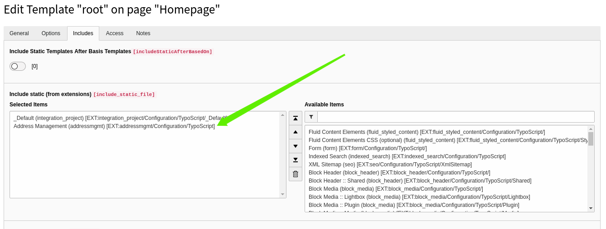

.. include:: ../../../Includes.txt

.. _TypoScript:

==========
TypoScript
==========

This page is divided into the following sections which are all configurable by using TypoScript:

.. contents::
  :local:
  :depth: 3

------------

Include static TypoScript
=========================

The extension ships some TypoScript code which needs to be included.

#. Switch to the root page of your site.
#. Switch to the **Template module** and select *Info/Modify*.
#. Press the link **Edit the whole template record** and switch to the tab *Includes*.
#. Select **Address Management (addressmgmt)** at the field *Include static (from extensions):*

Include TypoScript in site_package
----------------------------------

Another way is to include the addressmgmt TypoScript in a :ref:`TYPO3 site_package <t3sitepackage:start>`.
They are several kind of ways to include the TypoScript from extensions. Use your preferred way.

-------

Constants
=========

Address Management provides many settings through the *TYPO3 Constant Editor*.

.. important:: TYPO3 Constant Editor

  We strongly recommend to use the Constant Editor for project specific settings.

  Here you can find a tutorial about the `TYPO3 Constant Editor <https://docs.typo3.org/typo3cms/TyposcriptSyntaxReference/TypoScriptTemplates/TheConstantEditor/Index.html>`_.

The Constant Editor provides the following constants:

Persistence
-----------

storagePid
""""""""""

.. container:: table-row

  Property
    storagePid
  Data type
    int
  Default
    (none)
  Description
    The default pid of the page/folder that contains the address entries
  Example
    ::

      plugin.tx_addressmgmt.persistence.storagePid = 123

recursive
"""""""""

.. container:: table-row

  Property
    recursive
  Data type
    int
  Default
    (none)
  Description
    Recursive levels of child pages to fetch records from the `storagePid`
  Example
    ::

      plugin.tx_addressmgmt.persistence.recursive = 2

newRecordStoragePid
"""""""""""""""""""

.. container:: table-row

  Property
    newRecordStoragePid
  Data type
    int
  Default
    (none)
  Description
    Pid of folder / page where frontend created addresses are stored
  Example
    ::

      plugin.tx_addressmgmt.persistence.newRecordStoragePid = 130

orderBy
"""""""

.. container:: table-row

  Property
    Order by
  Data type
    string
  Default
    (none)
  Description
    Defines the field whicht should be used for sorting the list view. If nothing is set the `uid` will be used. Possible values are for example: `name`,  `first_name`, `crdate`
  Example
    ::

      plugin.tx_addressmgmt.settings.orderBy = title

orderDirection
""""""""""""""

.. container:: table-row

  Property
    Order direction
  Data type
    string
  Default
    (none)
  Description
    Define sorting of the list view (ASC,DESC)
  Example
    ::

      plugin.tx_addressmgmt.settings.orderDirection = ASC

showA-zFilter
"""""""""""""

.. container:: table-row

  Property
    showA-zFilter
  Data type
    boolean
  Default
    `0`
  Description
    Activates the A-Z Filter (with grouped items by first letter A - B ... - Z)
  Example
    ::

      plugin.tx_addressmgmt.settings.showA-zFilter =  1

pidsA-z
"""""""

.. container:: table-row

  Property
    pidsA-z
  Data type
    int
  Default
    (none)
  Description
    Pid A-Z: Page id for a-z list view
  Example
    ::

      plugin.tx_addressmgmt.settings.pidsA-z = 124

detailPid
"""""""""

.. container:: table-row

  Property
    detailPid
  Data type
    int
  Default
    (none)
  Description
    Default page id for detail/single view
  Example
    ::

      plugin.tx_addressmgmt.settings.detailPid = 125

pidsLogin
"""""""""

.. container:: table-row

  Property
    pidsLogin
  Data type
    int
  Default
    (none)
  Description
    PidsLogin: Login Page-Id for for redirect if FE User is not logged in
  Example
    ::

      plugin.tx_addressmgmt.settings.pidsLogin = 129

target.default
""""""""""""""

.. container:: table-row

  Property
    target.default
  Data type
    string
  Default
    `1:default`
  Description
    Defines the storage where files, uploaded by a frontend user will be stored. `1` stands for storage with the uid `1` - which is usually the folder `/fileadmin/`
  Example
    ::

      plugin.tx_addressmgmt.settings.target.default = 1:default

target.images
"""""""""""""

.. container:: table-row

  Property
    target.images
  Data type
    string
  Default
    `1:image`
  Description
    Defines the storage where images, uploaded by a frontend user will be stored. `1` stands for storage with the uid `1` - which is usually the folder `/fileadmin/`
  Example
    ::

      plugin.tx_addressmgmt.settings.target.images = 1:default

createDefaultAddressType
""""""""""""""""""""""""

.. container:: table-row

  Property
    createDefaultAddressType
  Data type
    sting
  Default
    (none)
  Description
    Create default address type. Possible values are `Tx_Addressbook_Location`, `Tx_Addressbook_Organisation`, `Tx_Addressbook_Person`. If no parameter is set here, the frontend user can choose, which which kind of record should be created
  Example
    ::

      plugin.tx_addressmgmt.settings.createDefaultAddressType = Tx_Addressbook_Organisation

Map Display
-----------

latitude
""""""""

.. container:: table-row

  Property
    latitude
  Data type
    string
  Default
    (none)
  Description
    Defines the latitude center of your map (if no pins are shown)
  Example
    ::

      plugin.tx_addressmgmt.settings.mapConfiguration.latitude = 14.000

longitude
"""""""""

.. container:: table-row

  Property
    longitude
  Data type
    string
  Default
    (none)
  Description
    Defines the longitude center of your map (if no pins are shown)
  Example
    ::

      plugin.tx_addressmgmt.settings.mapConfiguration.longitude = 30.000

fitBounds
"""""""""

.. container:: table-row

  Property
    fitBounds
  Data type
    boolean
  Default
    (none)
  Description
    Set the map boundaries to existing pins / locations shown
  Example
    ::

      plugin.tx_addressmgmt.settings.mapConfiguration.fitBounds = 1

clusterMarker
"""""""""""""

.. container:: table-row

  Property
    clusterMarker
  Data type
    boolean
  Default
    (none)
  Description
    Cluster results on the map. More infomation about `Leaflet Marker Cluster <https://github.com/Leaflet/Leaflet.markercluster>`_.
  Example
    ::

      plugin.tx_addressmgmt.settings.mapConfiguration.clusterMarker = 1

tileLayerConfiguration.options.accessToken
""""""""""""""""""""""""""""""""""""""""""

.. container:: table-row

  Property
    tileLayerConfiguration.options.accessToken
  Data type
    string
  Default
    (none)
  Description
    You need to add your `Mapbox <https://www.mapbox.com/>`_ access token, if you want to use the map feature. More `Information on Mapbox access token <https://docs.mapbox.com/help/getting-started/access-tokens/>`_
  Example
    ::

      plugin.tx_addressmgmt.settings.tileLayerConfiguration.options.accessToken = x3dma0ena4fdsajsapf

tileLayerConfiguration.options.id
"""""""""""""""""""""""""""""""""

.. container:: table-row

  Property
    tileLayerConfiguration.options.id
  Data type
    string
  Default
    `mapbox/streets-v11`
  Description
    Id of the `mapbox style <https://docs.mapbox.com/mapbox-gl-js/example/setstyle/>`_ (here street). This can change the visual presentation of your map.
  Example
    ::

      plugin.tx_addressmgmt.settings.tileLayerConfiguration.options.id = mapbox/outdoors-v11

tileLayerConfiguration.urlTemplate
""""""""""""""""""""""""""""""""""

.. container:: table-row

  Property
    tileLayerConfiguration.urlTemplate
  Data type
    string
  Default
    `https://api.mapbox.com/styles/v1/{id}/tiles/{z}/{x}/{y}?access_token={accessToken}`
  Description
    Normally you don not have to change this URL, als long as you want to use Mapbox and the Mapbox-API-Url-Schema does not change (which unfortunately happended in the past).
  Example
    ::

      plugin.tx_addressmgmt.settings.tileLayerConfiguration.urlTemplate = ...

tileLayerConfiguration.options.maxZoom
""""""""""""""""""""""""""""""""""""""

.. container:: table-row

  Property
    tileLayerConfiguration.options.maxZoom
  Data type
    string
  Default
    (none)
  Description
    Maximum zoom level for mapbox tile server. More `Information on Mapbox zoom level <https://docs.mapbox.com/help/glossary/zoom-level/>`_
  Example
    ::

      plugin.tx_addressmgmt.settings.tileLayerConfiguration.options.maxZoom = 10

tileLayerConfiguration.options.attribution
""""""""""""""""""""""""""""""""""""""""""

.. container:: table-row

  Property
    tileLayerConfiguration.options.attribution
  Data type
    string
  Default
    `© <a href='https://www.mapbox.com/about/maps/' target='_blank'>Mapbox</a> © <a href='http://www.openstreetmap.org/copyright' target='_blank'>OpenStreetMap</a> <strong><a href='https://www.mapbox.com/map-feedback/' target='_blank'>Improve this map</a></strong>`
  Description
    Attribution text for the Open Street Map. More `Information on Mapbox attribution <https://docs.mapbox.com/help/getting-started/attribution/>`_
  Example
    ::

      plugin.tx_addressmgmt.settings.tileLayerConfiguration.options.maxZoom = ...

------

Setup
=====

There are more settings avialable in the `setup.txt`. We explain here items that are not already defined by the constants above or those that might be not easy to understand.

editableCategoryConfiguration
-----------------------------

.. container:: table-row

  Property
    editableCategoryConfiguration
  Data type
    boolean
  Default
    (none)
  Description
    Here you can define the available SysCategories for frontend editing (for TYPO3 frontend users) by their root / parent category
  Example
    ::

      plugin.tx_addressmgmt.settings.editableCategoryConfiguration.default {
         rootCategory = 1
         orderBy = title
         sorting = ASC
      }

filterConfiguration
"""""""""""""""""""

.. container:: table-row

  Property
    filterConfiguration
  Data type
    boolean
  Default
    (none)
  Description
     Here you can define the available SysCategories for the frontend filter by their root / parent category. Feel free to add as many filters as you want. they will show up in the frontend automatically.
  Example
    ::

      plugin.tx_addressmgmt.settings.filterConfiguration {
         filter1 {
            rootCategory = 1
            orderBy = title
            sorting = DESC
         }
         filter2 {
            rootCategory = 3
            orderBy = sorting
            sorting = ASC
         }
      }

list.media.width
""""""""""""""""

.. container:: table-row

  Property
    list.media.width
  Data type
    int/string
  Default
    `320`
  Description
    Width of image in the list view
  Example
    ::

      plugin.tx_addressmgmt.settings.list.media.width = 400

