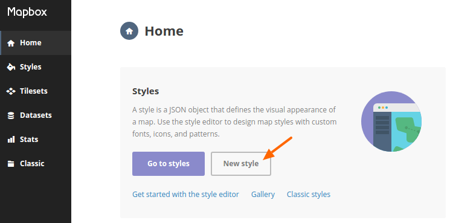

.. include:: ../../Includes.txt

.. _Map:

=========================
Map
=========================

Features
========

TYPO3 Addressmanagement can display addresses on a map. Therefore it provides fields for

* *Latitute* and *Lontitude* for Pins/Markers and
* *GeoJson* for Shapes/Polygones

on the map.

.. important::

   In order to use the map as described here you need an OpenStreetMap acccount. But it's also possbile to use other tile servers.

OpenStreetMap
=============

We decided to use for our map `OpenStreetMap <https://www.openstreetmap.org/>`_ . The map is created with  `Leaflet.js <http://leafletjs.com/>`_. As a tile server we are using `Mapbox <https://www.mapbox.com/>`_.

Using Mapbox
=========================

Mapbox is a tile sever provider for OpenStreet map and currently free until 50.000 tiles per months. For mid-sized project that's still enough.

In order to use Mapbox as a tileserver your first need to create a `Mapbox Account <https://www.mapbox.com/studio/signup/>`_.

After loggin it you will see the `Mapbox Studio home page <https://www.mapbox.com/studio>`_. Here you can create a new style. Here you find a manual about `How to create, edit and manage mapbox styles <https://www.mapbox.com/help/studio-manual/>`_.

After creating and saving you style you can access the share options. here you fill find a box like this

.. image:: Images/2017-03-14_mapbox-leflet-id-token.png
  :alt: Mapbox: Share Style for leaflet

Here you need to copy the **Leaflet URL** wich looks like this:

``https://api.mapbox.com/styles/v1/undkonsorten/ciuchHn17O1kbdzmlrcwr5vr4/tiles/256/{z}/{x}/{y}?access_token=pk.eYJ1IjoidW5ka26uc29yeGVuIiwiYSI6ImkrPGtvbmV6YjAwN3hubmtxY3gyMmdrNDAifQ.nN0Gx4tJhd4Ta9mzxW6XDw``

In this URL consists of your

* Mapbox username: ``undkonsorten``
* Style ID: ``ciuchHn17O1kbdzmlrcwr5vr4``
* Access-Token: ``pk.eYJ1IjoidW5ka26uc29yeGVuIiwiYSI6ImkrPGtvbmV6YjAwN3hubmtxY3gyMmdrNDAifQ.nN0Gx4tJhd4Ta9mzxW6XDw``

(PS: Don't use *this* URL, but create *your own*. We modified our access token. So it will NOT work!)
